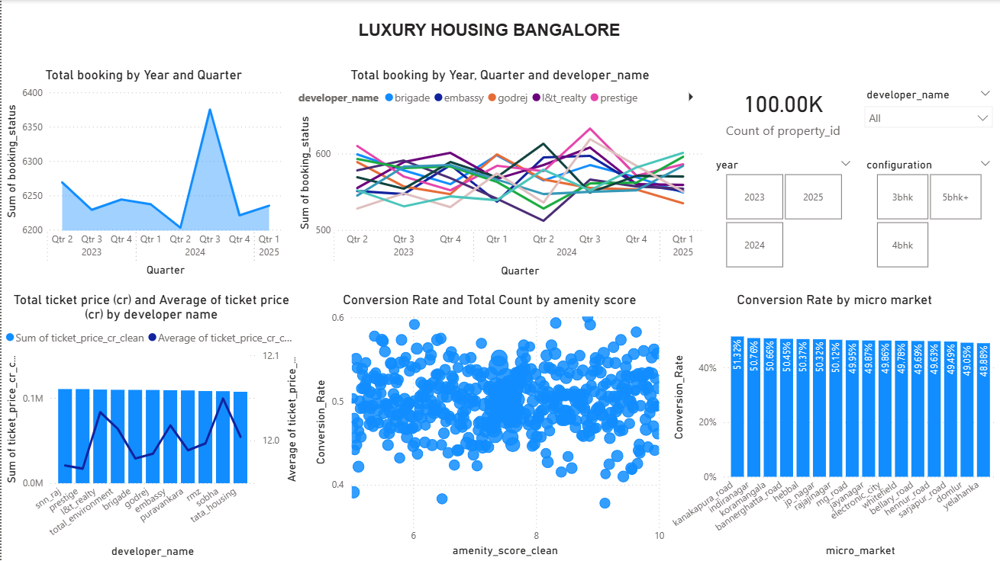
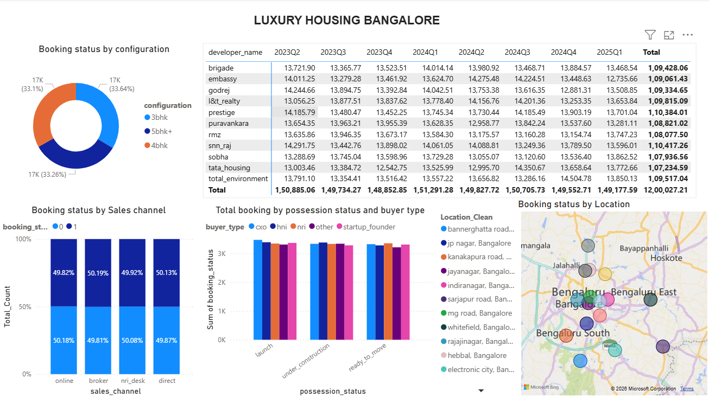
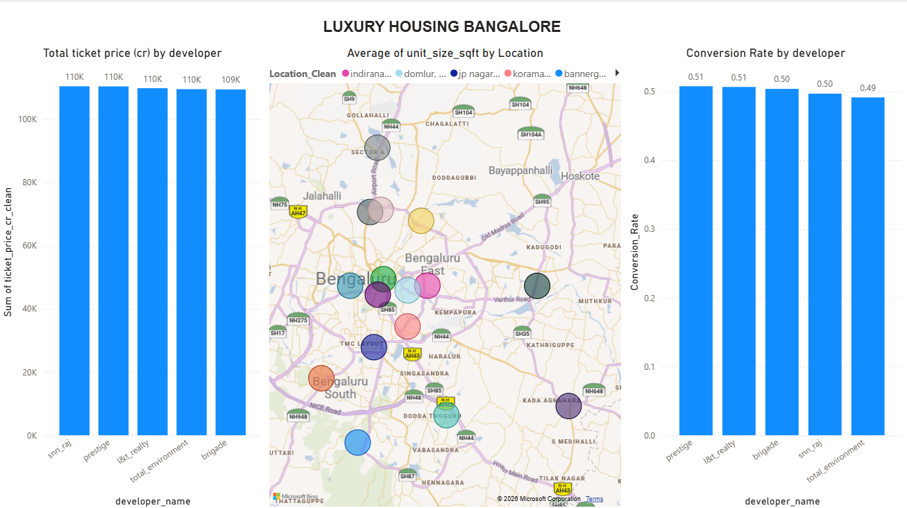

# 🏡 Luxury Housing Sales Analysis – Bengaluru

## 📌 Project Overview

This project presents an end-to-end data analytics solution for analyzing luxury housing trends in Bengaluru. It covers data cleaning, transformation, SQL integration, and interactive dashboard development using Power BI.

The objective is to derive actionable business insights related to market trends, builder performance, pricing strategies, and buyer behavior.

---

## 🎯 Business Objectives

* Analyze **market trends** across micro-markets and quarters
* Evaluate **builder performance** based on revenue and pricing
* Understand **buyer behavior and booking patterns**
* Study **impact of amenities on booking success**
* Identify **high-performing locations and sales channels**

---

## 🛠️ Tech Stack

* **Python** (Pandas, NumPy) – Data Cleaning & Feature Engineering
* **SQL (MySQL)** – Data Storage & Querying
* **Power BI** – Dashboard & Data Visualization

---

## 📂 Dataset Details

* Size: **100,000+ records**
* Domain: Real Estate (Luxury Housing)
* Key Features:

  * Micro Market
  * Developer Name
  * Configuration (3BHK, 4BHK, etc.)
  * Ticket Price (Cr)
  * Amenity Score
  * Booking Status
  * Sales Channel
  * Buyer Type
  * Purchase Quarter

---

## 🔧 Data Cleaning & Feature Engineering

* Handled missing values using **group-based imputation**
* Removed outliers using **IQR method**
* Standardized categorical variables
* Converted mixed-format price data into numeric
* Created new features:

  * `price_per_sqft`
  * `year`, `quarter`, `year_quarter`
  * `booking_status` (binary)
  * `has_comment`

---

## 🧠 Key Insights & Analysis

### 📈 Market Trends

* Booking patterns analyzed across quarters and micro-markets
* Identified high-growth and declining regions

### 🏗️ Builder Performance

* Top builders identified based on total revenue
* Compared average ticket size across developers

### 🏡 Amenity Impact

* Analyzed correlation between amenity score and booking success
* Found that higher amenities tend to improve conversion rates

### 📊 Booking Conversion

* Evaluated conversion rates across micro-markets
* Identified high-performing and underperforming areas

### 📡 Sales Channel Efficiency

* Compared booking success across sales channels
* Identified most effective channels

---

## 📊 Power BI Dashboard

The dashboard includes:

* Market trend analysis (Line chart)
* Builder performance (Bar chart)
* Amenity vs conversion (Scatter plot)
* Booking conversion (Stacked charts)
* Sales channel efficiency
* Top performers with drill-through capability
* Geographical insights (Map visualization)

## 📊 Dashboard Preview

### Page_1


### Page_2


### Page_3

---

## 🗺️ Geographical Analysis

* Cleaned and standardized location names for accurate mapping
* Visualized project distribution across Bengaluru micro-markets

---

## 🚀 Key Outcomes

* Built a **complete data pipeline (Python → SQL → Power BI)**
* Generated **actionable insights for real estate decision-making**
* Developed a **professional, interactive BI dashboard**

---

## 📁 Project Structure

```
├── luxury_housing_etl.ipynb
├── Luxury_Housing_Dashboard.pbix
├── Luxury_Housing_Analysis_Insights.pptx
├── README.md
```

---

## 💬 Conclusion

This project demonstrates the ability to transform raw data into meaningful insights using industry-standard tools and techniques. It highlights strong skills in data cleaning, analysis, visualization, and business storytelling.

---

## 👤 Author

**Gopinath S**

---
